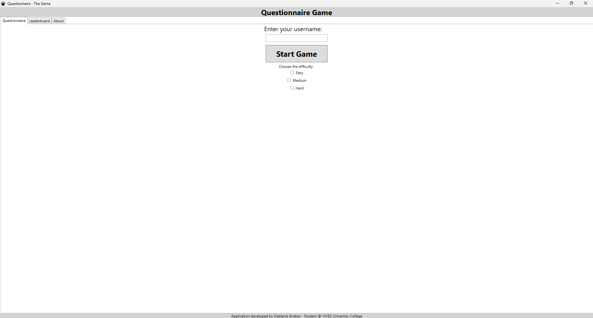
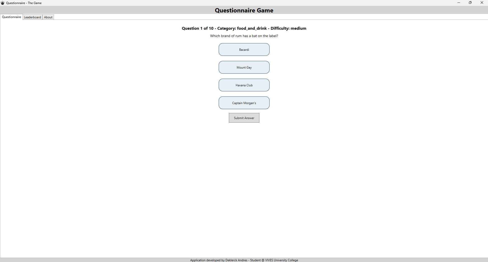
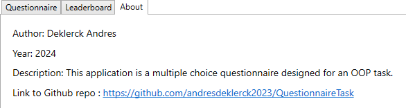
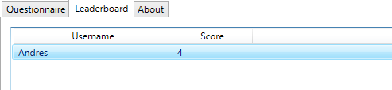

# QuestionnaireTask

## Project Description
The Questionnaire Application is a WPF-based quiz game that gets ( fetches ) multiple-choice questions from an online API ( https://the-trivia-api.com ) . The application allows users to select their preferred difficulty level (easy, medium, or hard) before starting the game. The user is presented with 10 questions, one at a time, and receives feedback on whether their answer was correct or not. The player's score is displayed at the end of the game, and a simple leaderboard is shown.

### Projects in the Solution
1. **Deklerck_Andres_WPFApplication_Questionnaire**: The main WPF application that handles the user interface and game logic.
2. **QuestionnaireLibrary**: A library that defines the data structures and interfaces used in the application.
3. **TriviaApiLibrary**: A library responsible for making API requests to fetch trivia questions from the online service.

## Author
- Andres Deklerck

## Screenshots





## Setup and Usage
### Prerequisites
- **Visual Studio**: Ensure you have Visual Studio installed with .NET desktop development workload.
- **.NET Core SDK**: Make sure the .NET Core SDK is installed on your system.

### Running the Application
1. Clone the repository to your local machine.
2. Open the solution file (`.sln`) in Visual Studio.
3. Set `Deklerck_Andres_WPFApplication_Questionnaire` as the startup project.
4. Build the solution to restore the necessary packages and compile the project.
5. Run the application from Visual Studio (F5).

## UML Class Diagrams
### QuestionnaireLibrary
```plaintext
+-------------------------------+
|        Project                |
+-------------------------------+
| - QuestionnaireLibrary        |
| - ScoreboardLibrary           |
| - TriviaApiLibrary            |
| - ConsoleApp                  |
| - WpfApp                      |
+-------------------------------+

+--------------------+     +---------------------+
|      Question      |     |        Answer       |
+--------------------+     +---------------------+
| - text: string     |     | - text: string      |
| - answers: List<Answer>| | - isCorrect: bool   |
+--------------------+     +---------------------+
| + Question(text: string,| + Answer(text: string, |
|   answers: List<Answer>)|   isCorrect: bool)   |
| + getAnswers(): List<Answer>|                  |
| + getCorrectAnswer(): Answer|                  |
+--------------------+     +---------------------+

+-----------------------+
|     Scoreboard        |
+-----------------------+
| - scores: List<PlayerScore> |
+-----------------------+
| + addPlayer(player: string, score: int): void |
| + sortScoreboard(): void |
| + getScores(): List<PlayerScore> |
+-----------------------+

+-----------------------+
|     PlayerScore       |
+-----------------------+
| - player: string      |
| - score: int          |
+-----------------------+
| + PlayerScore(player: string, score: int) |
+-----------------------+

+---------------------------+
|    MainWindow             |
+---------------------------+
| - questionList: List<Question> |
| - currentQuestion: Question |
+---------------------------+
| + MainWindow()             |
| + displayQuestion(question: Question): void |
| + submitAnswer(answer: Answer): void |
| + showScoreboard(): void  |
+---------------------------+

+---------------------------+
|    AboutWindow            |
+---------------------------+
| + AboutWindow()           |
+---------------------------+

+-------------------------------+
|  TriviaApiRequester           |
+-------------------------------+
| + RequestRandomQuestion(): Question |
+-------------------------------+

+---------------------------+
|  IQuestionHandler         |
+---------------------------+
| + handleQuestion(question: Question): void |
+---------------------------+


